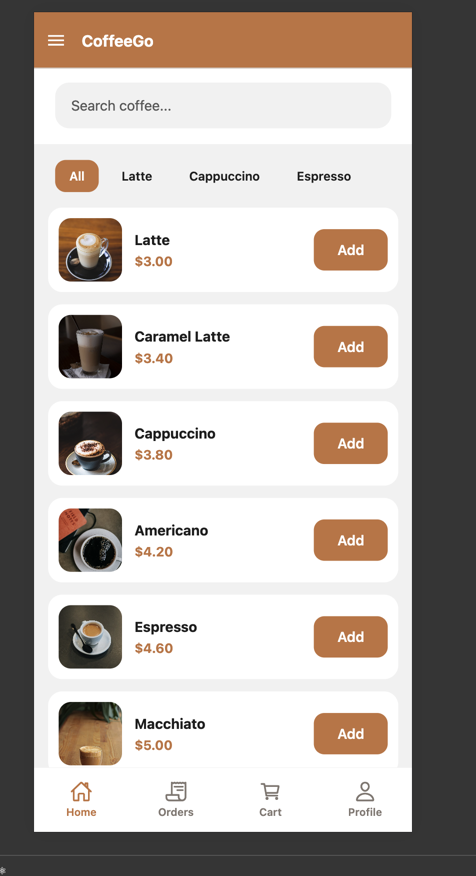
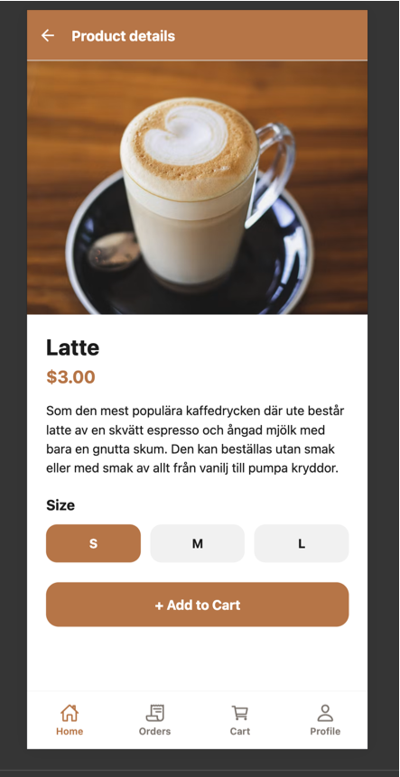
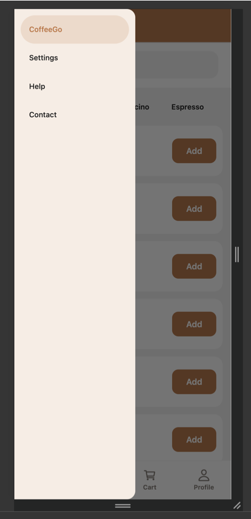
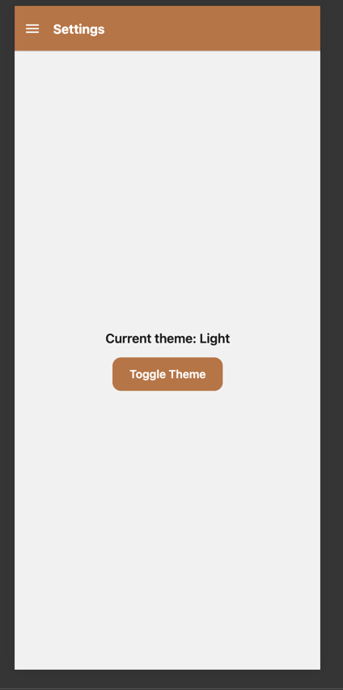
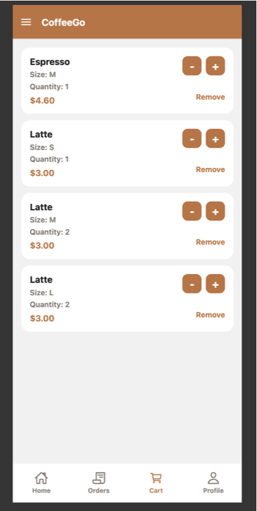

# CoffeeGo

CoffeeGo is a React Native app built with Expo and React Navigation. This homework 08 version adds Fetch API integration with an external coffee API so the menu is loaded from remote data instead of hardcoded items.

## API Integration

- API URL: https://api.sampleapis.com/coffee/hot
- Fetch API is used for network requests.
- API logic is isolated in `src/services/coffeeApi.js`.
- Data is normalized before rendering so screens receive consistent coffee items.
- Loading and error states are handled on the Home screen.

## Features

- Coffee list loaded from API
- Search by coffee name
- Category filtering (All, Latte, Cappuccino, Espresso)
- Product Details screen
- Drawer navigation
- Bottom tab navigation
- Size selector (S / M / L)
- Add to Cart button UI

## Data Flow

- Coffee data is fetched from the API when the Home screen loads.
- Results are stored in component state using React hooks.
- Coffee items are rendered using FlatList.
- Selecting a coffee opens Product Details and passes route parameters:
  - id
  - title
  - price
  - imageUrl
  - description

## Navigation Structure

```text
Drawer Navigator
└── Stack Navigator
    ├── Home
    ├── Product Details
    ├── Orders
    ├── Cart
    └── Profile
```

Additional Drawer Screens:
- Settings
- Help
- Contact

## Run Instructions

```bash
npm install
npm run web
```

## Screenshots

### Home Screen


### Product Details Screen


### Drawer Navigation


### Context API - Light Theme


The application uses ThemeContext and useContext to manage and switch between light and dark themes.

### Context API - Dark Theme


The application uses ThemeContext and useContext to manage and switch between light and dark themes.

### Redux Cart


The application uses Redux Toolkit for cart state management. Products can be added, removed, and their quantity can be updated.

## State Management

### Context API

Implemented ThemeContext using React Context API.

Features:
- ThemeProvider wraps the application.
- Theme state is shared through useContext.
- Toggle Theme button is available on the Settings screen.
- Light and Dark themes are supported.
- Theme state is consumed by multiple components.

### Redux

Implemented Redux Toolkit for cart management.

Features:
- configureStore setup in store.js
- cartSlice created with reducers:
  - addItem
  - removeItem
  - updateQuantity
- useSelector is used to read cart data.
- useDispatch is used to update cart state.
- Products can be added from Home and Product Details screens.
- Cart screen supports quantity updates and item removal.
